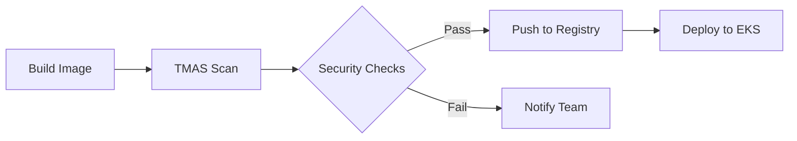

<div align="center">
  <h1>Trend Vision One - Container Security Demo Environment</h1>
  <p>
    <a href="https://github.com/ToluGIT/V1CS/actions">
      
    </a>
    
    
    
  </p>
  <p>A comprehensive demo environment for Trend Vision One Container Security, featuring automation scripts, security testing tools, and CI/CD pipeline integration with Trend Micro Artifact Scanner (TMAS).</p>
</div>

<p align="center">
  <a href="#-features">Features</a> •
  <a href="#-prerequisites">Prerequisites</a> •
  <a href="#-setup-instructions">Setup</a> •
  <a href="#-workflow">Workflow</a> •
  <a href="#-scripts">Scripts</a> •
  <a href="#-security">Security</a> •
  <a href="#-cleanup">Cleanup</a>
</p>

<h2 id="-features">🚀 Features</h2>

<ul>
  <li><strong>Infrastructure as Code:</strong> Automated AWS EKS cluster deployment using Terraform</li>
  <li><strong>Security Automation:</strong> Streamlined Trend Vision One Container Security deployment</li>
  <li><strong>CI/CD Integration:</strong> GitHub Actions workflows with TMAS for container scanning</li>
  <li><strong>Security Testing:</strong> Pre-configured applications and testing tools</li>
  <li><strong>Comprehensive Scanning:</strong> Vulnerability, malware, and secrets detection</li>
  <li><strong>Runtime Protection:</strong> Security event simulation and monitoring</li>
</ul>

<h2 id="-prerequisites">📋 Prerequisites</h2>

<h3>AWS Configuration</h3>
<ul>
  <li>AWS Account with administrative permissions</li>
  <li>AWS CLI v2.0+ configured with credentials</li>
  <li>Region: North Virginia (us-east-1)</li>
</ul>

<h3>Trend Vision One Setup</h3>
<ul>
  <li>Active Trend Vision One account</li>
  <li>Container Security module enabled</li>
  <li>TMAS API key configured</li>
</ul>

<h3>Development Tools</h3>
<ul>
  <li>Terraform ≥ 1.0</li>
  <li>kubectl (compatible with EKS 1.20+)</li>
  <li>Helm ≥ 3.0</li>
  <li>jq (latest version)</li>
</ul>

<h2 id="-setup-instructions">⚙️ Setup Instructions</h2>

<h3>1. Initial AWS Setup</h3>

<pre><code># Configure AWS CLI
aws configure

# Create Terraform state bucket
aws s3 mb s3://your-terraform-state-bucket \
  --region us-east-1

# Create state locking table
aws dynamodb create-table \
  --table-name terraform-state-locks \
  --attribute-definitions AttributeName=LockID,AttributeType=S \
  --key-schema AttributeName=LockID,KeyType=HASH \
  --provisioned-throughput ReadCapacityUnits=1,WriteCapacityUnits=1 \
  --region us-east-1</code></pre>

<h3>2. EKS Deployment</h3>

<pre><code># Initialize and deploy EKS
cd Terraform
terraform init
terraform plan    # Review changes
terraform apply   # Deploy infrastructure</code></pre>

<h3>3. Container Security Setup</h3>

1. In Trend Vision One Console:
   - Create Runtime Security Ruleset
   - Configure Container Protection Policy
   - Download `overrides.yaml`

2. Deploy security components:
<pre><code>./deploy_v1cs.sh</code></pre>

<h2 id="-workflow">🔄 GitHub Workflow Integration</h2>

<h3>Workflow Architecture</h3>



<h3>1. Security Scanning Workflow</h3>

<pre><code>name: docker-image-security-scan-tmas

on:
  workflow_dispatch:  # Manual trigger
  push:
    branches: [ main ]  # Auto trigger on main

env:
  TMAS_API_KEY: ${{ secrets.TMAS_API_KEY }}
  THRESHOLD: "medium"
  MALWARE_SCAN: true
  SECRETS_SCAN: true</code></pre>

<h3>2. Deployment Workflow</h3>

<pre><code>name: Deploy to K8S

on:
  workflow_run:
    workflows: ["docker-image-security-scan-tmas"]
    types: [completed]</code></pre>

<h3>Required Secrets</h3>

<table>
  <tr>
    <th>Secret Name</th>
    <th>Description</th>
    <th>Required</th>
  </tr>
  <tr>
    <td>TMAS_API_KEY</td>
    <td>Trend Micro Artifact Scanner API key</td>
    <td>Yes</td>
  </tr>
  <tr>
    <td>AWS_ACCESS_KEY_ID</td>
    <td>AWS access key for EKS access</td>
    <td>Yes</td>
  </tr>
  <tr>
    <td>AWS_SECRET_ACCESS_KEY</td>
    <td>AWS secret key for EKS access</td>
    <td>Yes</td>
  </tr>
  <tr>
    <td>GH_TOKEN</td>
    <td>GitHub token for GHCR access</td>
    <td>Yes</td>
  </tr>
  <tr>
    <td>SLACK_BOT_TOKEN</td>
    <td>Slack notifications (optional)</td>
    <td>No</td>
  </tr>
</table>

<h2 id="-scripts">🛠️ Automation Scripts</h2>

<h3>Deployment Script (deploy_v1cs.sh)</h3>

```bash
# Full deployment
./deploy_v1cs.sh

# Remove components
./deploy_v1cs.sh cleanup

# Check status
./deploy_v1cs.sh verify
```

<h3>Testing Script (attack_v1cs.sh)</h3>

```bash
# View all options
./attack_v1cs.sh -h

# Run full test suite
./attack_v1cs.sh -tv app-server-1 full

# Run specific test
./attack_v1cs.sh -n demo -t app-server-2 privesc
```

<h2 id="-security">🔒 Security Features</h2>

<h3>Container Security</h3>
<ul>
  <li><strong>Runtime Protection:</strong>
    <ul>
      <li>Process monitoring</li>
      <li>File system protection</li>
      <li>Network security</li>
    </ul>
  </li>
  <li><strong>Image Scanning:</strong>
    <ul>
      <li>Vulnerability assessment</li>
      <li>Malware detection</li>
      <li>Secrets scanning</li>
      <li>SBOM generation</li>
    </ul>
  </li>
</ul>

<h2 id="-structure">📁 Repository Structure</h2>

```
.
├── .github/workflows/          # CI/CD workflows
│   ├── imgcreate-push.yaml    # TMAS scanning
│   └── prod-deploy.yaml       # EKS deployment
├── calico/                    # Network policies
├── Terraform/                 # Infrastructure
├── app-server-[1,2].yaml     # Demo apps
├── attack_v1cs.sh            # Security tests
├── deploy_v1cs.sh            # Deployment
└── install_tmas.cli.sh       # TMAS setup
```

<h2 id="-cleanup">🧹 Cleanup</h2>

```bash
# 1. Remove Container Security
./deploy_v1cs.sh cleanup

# 2. Destroy AWS infrastructure
cd Terraform
terraform destroy -auto-approve

# 3. Clean local files
rm -rf .terraform
rm -f terraform.tfstate*
```

<h2>⚠️ Important Notes</h2>

<ul>
  <li>All resources deploy to us-east-1 (N. Virginia)</li>
  <li>Contains intentionally vulnerable components for testing</li>
  <li>Includes EICAR test file for malware detection</li>
  <li>Use in isolated test environments only</li>
</ul>

<h2>💬 Contribute</h2>

<ul>
  <li>🐛 Issues: Create a GitHub issue</li>
</ul>

<div align="center">
  <br>
  <p>
    <sub>Built with ❤️ for container security</sub>
    <br>
    <sub>© 2024 ToluGIT. All rights reserved.</sub>
  </p>
</div>
